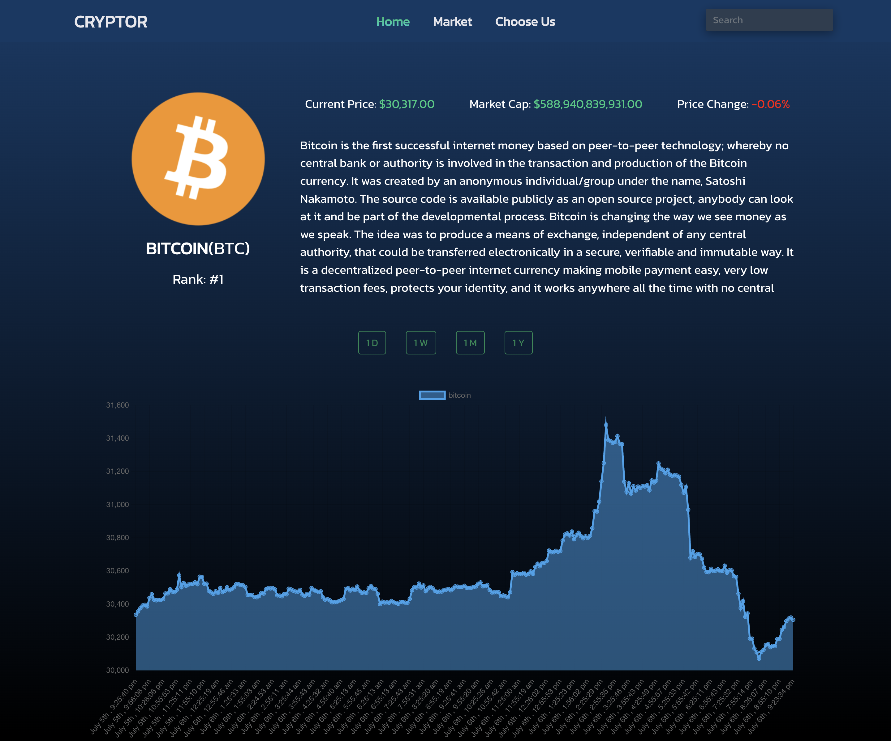

<h2>About the project</h2>

  
<b>CryptoR</b> is a responsive website that allows users to search for information about various cryptocurrencies in real time, that also updates with time. 
 
The website is also connected to API. By using API, the website can provide users with real- time information about the latest cryptocurrency prices and market trends.

<h3>Build with:</h3>

» React JS 
» Coingecko API 
» Bootstrap

<h2 align='center'>Screenshots of the Project 📸</h2>
 

 

 

